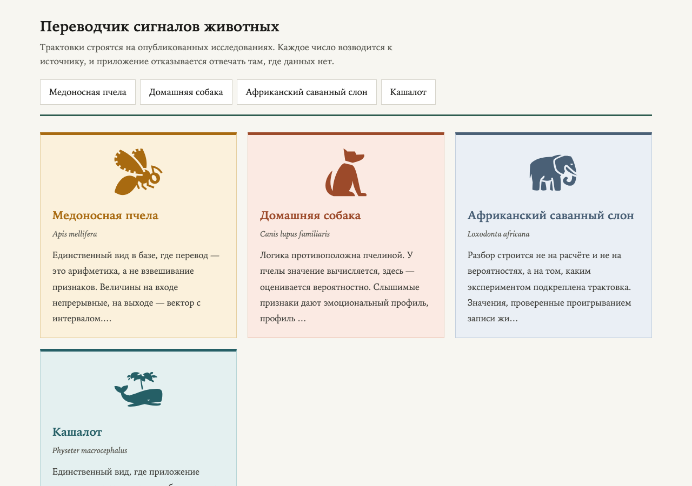
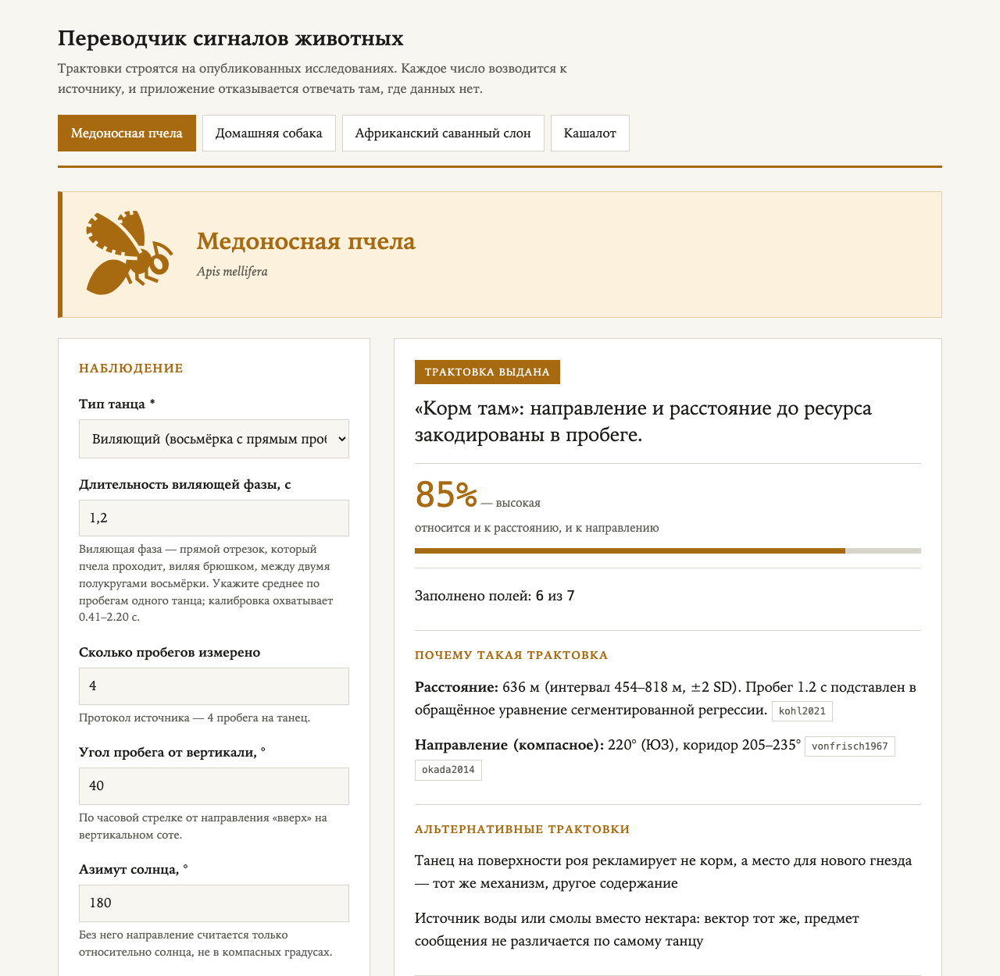
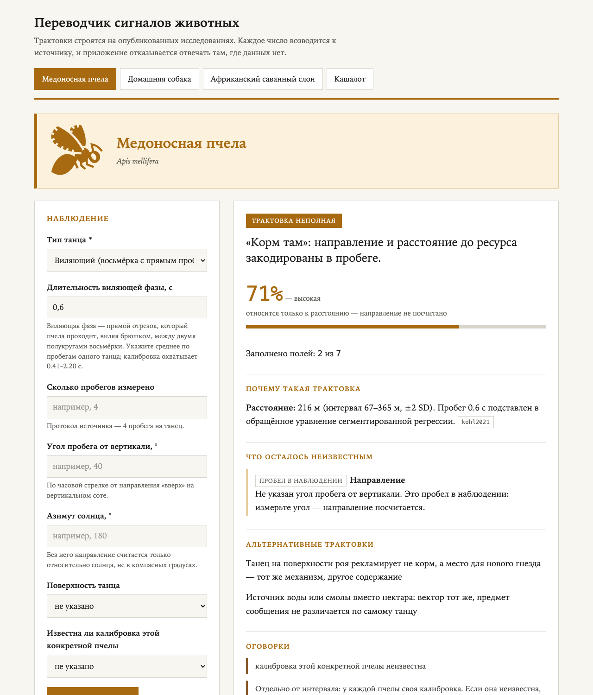
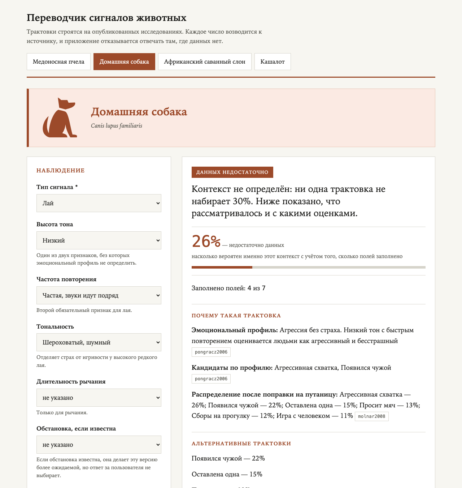
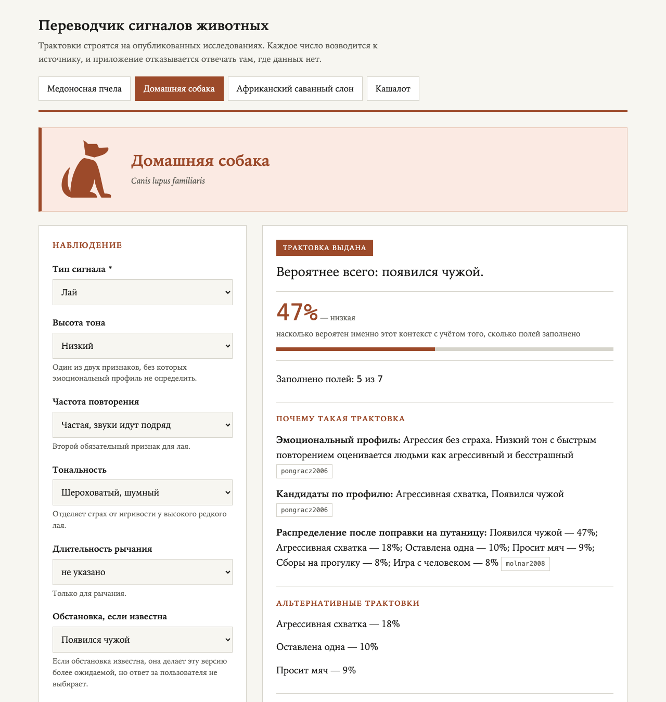
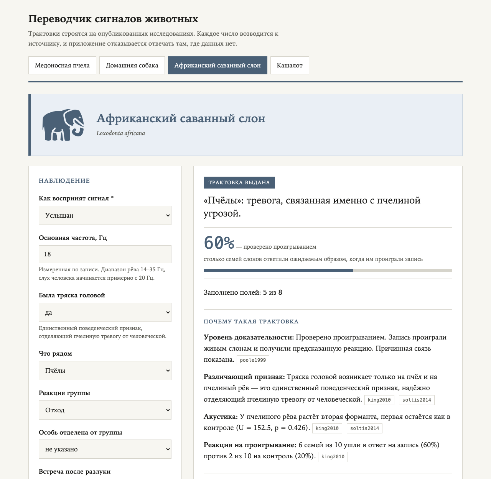
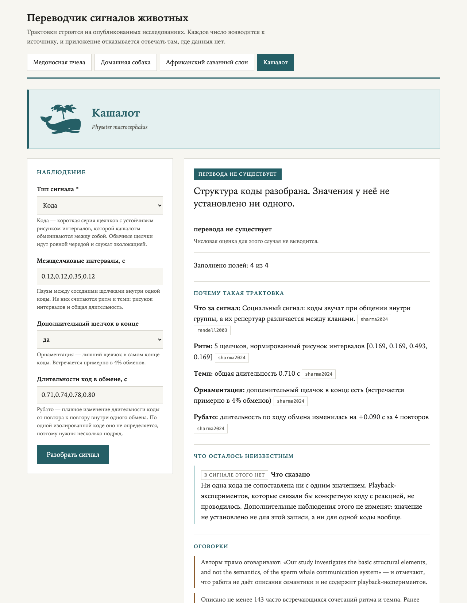
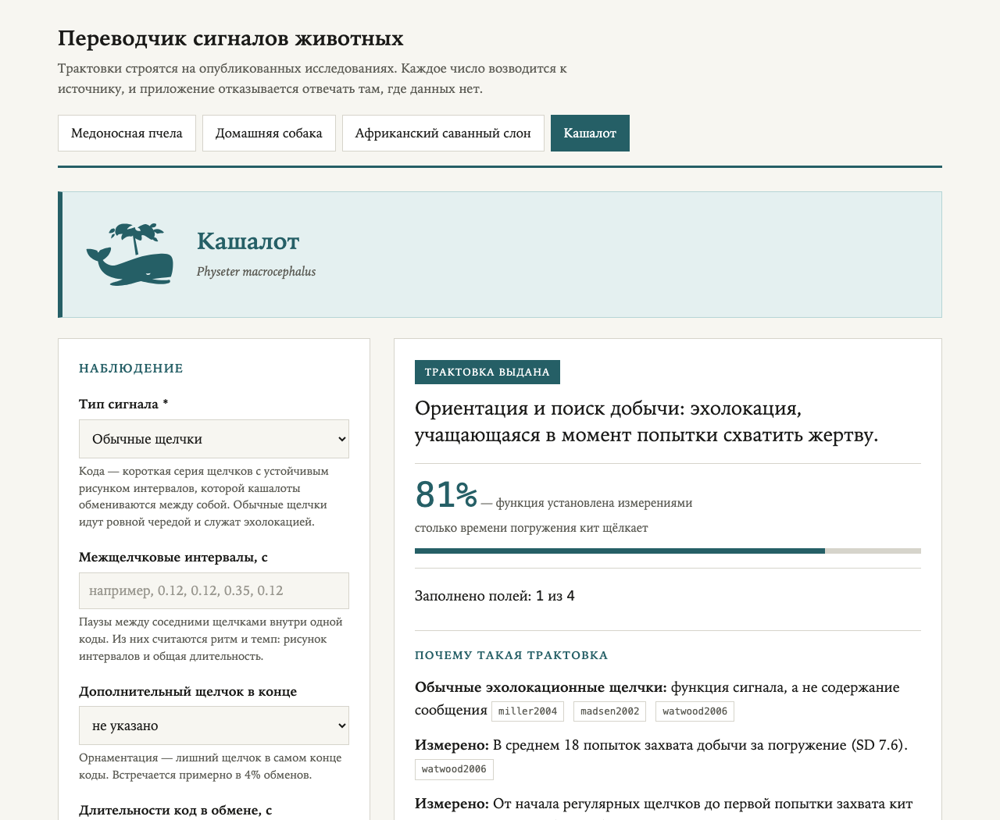
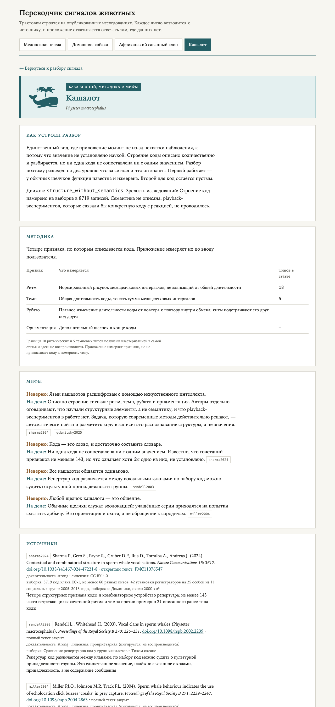

# Переводчик сигналов животных

Веб-приложение и JSON API, которые разбирают наблюдение за сигналом животного и
выдают вероятную трактовку: что означает сигнал, насколько надёжен вывод, какие
есть альтернативы и на каких исследованиях всё держится.

Поддержаны четыре вида — медоносная пчела, домашняя собака, африканский саванный
слон и кашалот. У каждого своя форма наблюдения и свой способ разбора: у пчелы
расстояние и направление вычисляются по опубликованным уравнениям, у собаки
контекст оценивается вероятностно по матрице путаницы из исследования, у слона
трактовки ранжируются по тому, каким экспериментом подкреплены.

Приложение показывает не только ответ, но и его разбор: какие признаки сработали,
откуда взято каждое число и чего не хватает в наблюдении. Там, где данных нет,
оно говорит об этом прямо и различает четыре разных причины — от «доснимите
наблюдение» до «наука этого ещё не установила».

Стек: FastAPI со схемой OpenAPI, база знаний из 32 источников с DOI, производная
SQLite для запросов.

---

## Содержание

- [Как запустить](#как-запустить)
- [Скриншоты](#скриншоты)
- [API](#api)
- [Запросы к базе](#запросы-к-базе)
- [Что внутри](#что-внутри)
- [Виды и почему логика разная](#виды-и-почему-логика-разная)
- [Как устроена база знаний](#как-устроена-база-знаний)
- [Как работает логика перевода](#как-работает-логика-перевода)
- [Как считается уверенность](#как-считается-уверенность)
- [Когда приложение не отвечает](#когда-приложение-не-отвечает)
- [Тесты](#тесты)
- [Источники](#источники)
- [Что использовано из AI](#что-использовано-из-ai)
- [Ограничения](#ограничения)
- [Что можно добавить](#что-можно-добавить)
- [Лицензии](#лицензии)

---

## Как запустить

Нужен Python 3.12.

```bash
python3 -m venv .venv
source .venv/bin/activate        # Windows: .venv\Scripts\activate
pip install -e ".[dev]"
python3 run.py
```

Приложение откроется на `http://127.0.0.1:8000`, документация API — на
`http://127.0.0.1:8000/docs`. Порт задаётся аргументом: `python3 run.py 8765`.

Если окружение не активировано, запускать надо явно из него:
`.venv/bin/python run.py`.

Через Docker, без установки чего-либо на машину:

```bash
docker build -t animal-translator .
docker run -p 8000:8000 animal-translator
```

Тесты (окружение должно быть активировано):

```bash
python3 -m unittest discover -s tests
```

## Скриншоты

Главная страница: четыре вида, у каждого своя форма наблюдения и свой способ
разбора.



Пчела. По длительности виляющего пробега и углу к вертикали приложение считает,
где находится ресурс: 636 метров, направление 220° с коридором ±15°. Рядом с
каждым шагом стоит идентификатор статьи, из которой взята формула.



Тот же вид, но угол пробега не измерен. Расстояние посчитано — 216 метров, — а
направление помечено как пробел в наблюдении: его можно доснять. Видно и другое
следствие модели: на близких дистанциях интервал шире самой оценки, 67–365 метров.



Собака, заполнены только звуковые признаки. Ни одна из шести версий не набирает
30%, поэтому ответ не выдаётся. Вместо пустого экрана приложение показывает всё
распределение и подсказывает, какое наблюдение сузило бы выбор.



Та же запись, но добавлено одно поле — обстановка. Распределение сузилось,
верхняя версия набрала 47%, и ответ выдан.



Слон. Тревогу на пчёл отличает от тревоги на людей один признак — тряска головой.
Что рёв действительно означает тревогу, проверили опытом: диким слонам проиграли
рёв, записанный при встрече с пчёлами, и шесть семей из десяти ушли. На
собственный спокойный рёв, записанный до опыта, уходили только две.



Кашалот. Приложение измеряет строение коды — ритм, темп, рубато, орнаментацию, —
но не переводит её. Значение ни одной коды науке пока не известно, и авторы
исследования пишут об этом прямо; их оговорка приведена в ответе.



Тот же вид, но обычные щелчки: их функция известна — эхолокация при поиске
добычи. Число 81% здесь означает долю времени погружения, которую кит
эхолоцирует, а не уверенность в трактовке; в интерфейсе это подписано под самим
процентом.



База знаний вида целиком: как устроен разбор, измеренные величины с указанием
статей, разбор распространённых заблуждений и библиография — с выборками,
лицензиями и пометкой, доступен ли полный текст.



Документация API. Собирается из моделей Pydantic, поэтому описания полей и схема
ответов всегда совпадают с кодом. Любой запрос выполняется прямо со страницы.


Скриншоты пересобираются одной командой: `python3 scripts/screenshots.py`.

---

---

## API

Разбор наблюдения вызывается и со страниц, и по HTTP: логика одна, отличается
только форма ответа — разметка или JSON. Страницы и API вызывают один и тот же код
разбора, а не друг друга. Документация и схема генерируются из моделей Pydantic.

| Адрес | Что там |
|---|---|
| `/docs` | Swagger UI: каждый запрос можно выполнить прямо в браузере |
| `/redoc` | То же самое в виде справочника, без выполнения запросов |
| `/openapi.json` | Схема OpenAPI 3.1 |

| Метод и путь | Что делает |
|---|---|
| `GET /api/health` | Health check: статус, версия, число видов |
| `GET /api/species` | Список видов и того, как устроен разбор у каждого |
| `GET /api/species/{slug}` | Схема ввода, источники и мифы вида |
| `GET /api/translate?species=…&<поля>` | Разбор, значения строками |
| `POST /api/translate` | То же, значения своих типов |

`{slug}` — короткое имя вида в адресе: `honeybee`, `dog`, `elephant`,
`spermwhale`. Оно же служит именем файла в `data/knowledge` и ключом в базе.

Схема наблюдения приходит в `GET /api/species/{slug}` полем `input_schema`, и поля
запроса берутся оттуда: у каждого вида они свои.

```bash
curl "http://127.0.0.1:8000/api/translate?species=dog&signal_type=bark\
&pitch=low&repetition=fast&tonality=atonal&reported_situation=stranger"
```

```json
{
  "species": "dog",
  "fields_filled": 5,
  "fields_total": 7,
  "result": {
    "verdict": "translated",
    "headline_ru": "Вероятнее всего: появился чужой.",
    "confidence": 0.465,
    "confidence_scope_ru": "насколько вероятен именно этот контекст…",
    "steps": [...], "unknowns": [...], "alternatives_ru": [...],
    "source_ids": ["pongracz2006", "molnar2008"]
  },
  "sources": [{"id": "pongracz2006", "doi": "10.1016/j.applanim.2005.12.004", "...": "..."}]
}
```

Через POST те же значения передаются своими типами, включая списки чисел —
пример готового запроса есть на странице `/docs`.

Ошибки приходят в одном виде — тело лежит в `detail`, как принято в FastAPI, и
называет поле, из-за которого запрос не прошёл:

```json
{"detail": {"message": "Неизвестные поля для вида 'dog': pitchh", "field": "pitchh"}}
```

Коды: `400` — данные не подошли, `404` — нет такого вида, `422` — запрос не
прошёл проверку схемы.

Четыре типа неопределённости перечислены прямо в схеме, поэтому клиент может на них
опираться: `data_gap`, `not_encoded`, `not_applicable`, `beyond_model`.

---

## Запросы к базе

Первоисточник — JSON-файлы в `data/knowledge`. Из них собирается база SQLite,
чтобы можно было запрашивать все виды сразу. В репозитории база не хранится:
её создаёт скрипт.

```bash
python3 scripts/build_db.py          # собрать data/knowledge.db
python3 scripts/build_db.py --demo   # собрать и выполнить примеры запросов
python3 scripts/build_db.py --check  # убедиться, что база не отстала от JSON
```

### Схема

Десять таблиц с внешними ключами, ограничениями и индексами:

| Таблица | Что хранит | Виды |
|---|---|---|
| `species` | Виды и их движки | все |
| `sources` | Библиография: DOI, лицензия, доказательность, статус доступа, поправки | все |
| `myths` + `myth_sources` | Мифы и связь с источниками, многие-ко-многим | все |
| `input_fields` + `input_options` | Схема формы с сохранением порядка полей | все |
| `contexts` | Контексты лая с размерами выборок | собака |
| `context_reliability` | Доля распознавания, каппа, значимость | собака |
| `confusion` | Матрица путаницы: истинный контекст → принятый за него | собака |
| `meta` | Время сборки и отпечаток исходных файлов | — |

Три таблицы заполнены только для собаки: у неё измерения естественно ложатся в
таблицу, а у пчелы то же место занимают коэффициенты уравнений, у слона — уровни
доказательности, у кашалота — признаки коды. Сводить их вместе значило бы
придумать сходство, которого нет.

Отпечаток в `meta` ловит рассинхронизацию: `--check` сравнивает его с текущим
состоянием `data/knowledge`.

### Примеры запросов

Сколько источников на вид и какая доля доступна целиком:

```sql
SELECT s.name_ru, COUNT(*) AS всего,
       SUM(src.open_access_kind IS NOT NULL) AS открытых,
       MIN(src.year) || '–' || MAX(src.year)  AS годы
  FROM sources src JOIN species s ON s.slug = src.species_slug
 GROUP BY s.slug ORDER BY всего DESC;
```

```
Медоносная пчела           11   3   1967–2023
Африканский саванный слон   8   2   1988–2024
Домашняя собака             7   1   1995–2010
Кашалот                     6   2   2002–2025
```

Ещё четыре запроса — в `scripts/build_db.py`, все выполняются командой `--demo` и
покрыты тестом. Самый показательный из них про собаку: «появился чужой» работает
воронкой — в него стекаются ошибки почти со всех остальных контекстов, и по
отдельным строкам матрицы это не заметно.

---

## Что внутри

```
data/knowledge/*.json     база знаний: по файлу на вид
data/illustrations/       пиктограммы видов и сведения об их авторах
src/animal_translator/
  knowledge.py            загрузка базы
  result.py               общий формат ответа для всех видов
  forms.py                разбор присланных значений формы
  app.py                  приложение FastAPI: маршруты и отдача HTML
  schemas.py              модели Pydantic, из них собирается схема OpenAPI
  api.py                  разбор в виде данных, без знания о HTTP
  web.py                  отрисовка страниц
  illustrations.py        пиктограммы и цветовые акценты
  species/*.py            движки разбора, по одному на вид
tests/                    проверки движков, базы знаний, API и интерфейса
pyproject.toml            зависимости и требование Python 3.12
scripts/build_db.py       сборка SQLite из базы знаний
scripts/screenshots.py    пересборка скриншотов
```

---

## Виды и почему логика разная

ТЗ требует, чтобы логика для разных животных отличалась. Здесь она отличается не
оформлением, а способом получения ответа — потому что о разных видах известно
принципиально разное.

| Вид | Движок | Как получается ответ |
|---|---|---|
| **Медоносная пчела** | `quantitative` | Арифметика: длительность пробега подставляется в опубликованное уравнение, на выходе вектор с интервалом |
| **Домашняя собака** | `bayesian_confusion` | Вероятностный вывод: признаки дают эмоциональный профиль, опубликованная матрица путаницы превращает его в распределение по шести контекстам |
| **Африканский саванный слон** | `evidence_tiered` | Ранжирование по доказательности: значения, проверенные проигрыванием, стоят выше известных лишь по совместной встречаемости |
| **Кашалот** | `structure_without_semantics` | Структура сигнала разбирается, но значение не установлено ни для одной коды. Молчание вызвано состоянием науки, а не нехваткой наблюдения |

Различие проверяется тестом `test_engines_are_distinct`, а не только описывается.

---

## Как устроена база знаний

Хранилище — четыре JSON-файла в `data/knowledge`, по одному на вид, около 1700
строк суммарно. Источником правды выбран именно JSON, а не база: файл
открывается редактором и читается глазами, а правка коэффициента видна в истории
git отдельной строкой. Запрашиваемая форма собирается из него отдельно — см.
[Запросы к базе](#запросы-к-базе).

В каждом файле есть общие блоки:

| Блок | Что хранит |
|---|---|
| `sources` | Библиография: авторы, DOI, журнал, выборка, лицензия, доказательность, статус открытого доступа |
| `myths` | Пары «неверно / на деле» со ссылками на источники |
| `input_schema` | Поля формы: тип, подсказка, пример значения |
| `engine`, `engine_note_ru` | Какой движок у вида и почему именно такой |

И блоки, своеобразные для вида: у пчелы `quantitative_model` с коэффициентами
уравнений, у собаки `confusion_matrix` и `reliability`, у слона `evidence_tiers`,
у кашалота `structure` и `levels`.

Три правила, каждое проверяется тестом:

1. **Ни одно число не зашито в код.** Движки читают коэффициенты и пороги из
   базы. Тест `test_engines_declare_no_numeric_module_constants` запрещает
   числовые константы уровня модуля в движках.
2. **Каждый коэффициент объявляет происхождение** — либо `source` с указанием
   места в статье, либо `heuristic` с объяснением, почему выбрана такая величина.
3. **Каждый источник используется.** Библиография для вида невозможна: тест
   `test_every_source_is_actually_used` находит источники, на которые никто не
   ссылается.

---

## Как работает логика перевода

### Пчела — вычисление

Расстояние берётся из сегментированной регрессии Kohl & Rutschmann (2021),
уравнения обращаются:

```
tw ≤ 1.767 с:   d = (tw − 0.2917) / 1.4282
tw > 1.767 с:   d = (tw − 1.0767) / 0.6683
```

Пробег 1.2 с даёт 636 м. Интервал строится не наугад: стандартные отклонения
длительности из той же статьи (0.10 с на 100 м и 0.19 с на 1.7 км)
интерполируются и прогоняются через обращённое уравнение. Побочное следствие
видно в интерфейсе: у ближних ресурсов относительная точность заметно хуже —
пробег 0.6 с даёт 216 м с интервалом 67–365 м.

Направление считается по правилу фон Фриша: угол пробега от вертикали равен углу
цели относительно азимута солнца. Коридор ±15° взят из Okada et al. (2014), где
304 пробега из 358 уложились в эту величину.

### Собака — вероятностный вывод

Слышимые признаки дают эмоциональный профиль по Pongrácz et al. (2006): низкий
тон с быстрым повторением — агрессия, высокий редкий чистый — страх, высокий
редкий шероховатый — игривость. Профиль указывает на контексты-кандидаты, а
опубликованная матрица путаницы из Molnár et al. (2008) превращает их в
распределение по всем шести контекстам.

Альтернативные трактовки — не выдумка, а остальные строки того же распределения.

### Слон — уровень доказательности

Каждая трактовка помечена тем, каким экспериментом подкреплена:
`playback_verified` (запись проигрывали слонам и получили предсказанную реакцию),
`contextual` (сигнал наблюдали в ситуации, но проигрыванием не проверяли),
`descriptive`. Порядок строгий: контекстная трактовка не может вытеснить
проверенную, даже если совпала лучше.

Отдельно учитывается инфразвук: основная частота рёва 14–35 Гц, слух человека
начинается примерно с 20 Гц, поэтому наблюдение «на слух» помечается как заведомо
неполное.

### Кашалот — структура без значения

Единственный сигнал, у которого функция установлена, — обычные эхолокационные
щелчки. Watwood et al. (2006) на 198 погружениях 37 особей измерили: регулярные
щелчки занимают 81% времени погружения, в среднем 18 попыток захвата добычи за
погружение, а от начала щелчков до первой попытки кит опускается на 392 м. Это
подтверждает роль щелчков как дальнего биосонара, а не обращения к сородичу.

Структура коды измеряется по четырём признакам из Sharma et al. (2024): ритм,
темп, рубато, орнаментация. Значение не выдаётся ни при каком вводе, и в ответе
приводится оговорка самих авторов: *«Our study investigates the basic structural
elements, and not the semantics, of the sperm whale communication system»*.

Границы 18 ритмических и 5 темповых типов получены кластеризацией в статье и
здесь не воспроизводятся — приложение измеряет признаки, но не присваивает коду
номерному типу.

---

## Как считается уверенность

Единой формулы намеренно нет: у разных видов уверенность означает разное, и
подводить это под одну шкалу было бы подменой.

| Вид | Что означает число | Предел |
|---|---|---|
| **Пчела** | Правдоподобие вычисленного вектора | до 94.7%; не выше 85%, когда считается и направление |
| **Собака** | Вероятность контекста после поправки на путаницу | до 71.4% |
| **Слон** | Доля семей, ответивших на проигрывание записи | 60% у тревоги на пчёл; для остальных сигналов измерений нет |
| **Кашалот** | Доля времени погружения, занятая щелчками | 81% у щелчков; у код числа нет вовсе |

Пределы не назначены, а вытекают из данных: у пчелы это качество подгонки модели
(R² = 0.947), у собаки — то, насколько акустика вообще разделяет шесть контекстов.

**Пчела.** `R² × протокол × диапазон × калибровка`. Первый множитель — качество
подгонки модели из статьи, остальные три только снижают результат: это
эвристические штрафы за неполный протокол, экстраполяцию и неизвестную
калибровку особи, все помечены как эвристики. Поэтому выше **94.7%** уверенность
не поднимается ни при каком вводе, а при расчёте направления — выше 85%, потому
что коридор ±15° покрывает 85% пробегов. Отдельной строкой показывается
систематическое смещение до 50% при неизвестной калибровке особи (Schürch et al.,
2016): это не случайный разброс, поэтому в интервал не входит.

**Собака.** Апостериорная вероятность верхнего контекста, умноженная на полноту
ввода. Величина ограничена сверху не настройкой, а самой путаницей между
контекстами: даже при полном вводе она не достигает 80%.

**Слон.** Для сигналов, проверенных проигрыванием, показывается **измеренная доля
отклика** — например, 6 семей из 10 ушли в ответ на запись пчелиного рёва против
2 из 10 на контроль. Это не правдоподобие трактовки, а другая величина, поэтому
шкала «низкая / средняя / высокая» к ней не применяется.

**Кашалот.** Для коды числа нет: количественной модели значения не опубликовано.
Для эхолокационных щелчков показывается **81%** — измеренная Watwood et al. (2006)
доля времени погружения, занятая регулярными щелчками. Это не уверенность в
трактовке, и область действия подписана прямо под числом.

К проценту всегда прилагается область действия: относится ли он к вектору целиком
или только к расстоянию, к правдоподобию или к доле отклика.

---

## Когда приложение не отвечает

Четыре разные причины, и они не смешиваются:

| Пометка | Что означает | Пример |
|---|---|---|
| **Пробел в наблюдении** | Не хватает измерения, его можно доснять | Не указан угол пробега у пчелы |
| **В сигнале этого нет** | Сигнал такой информации не несёт в принципе | Дрожащий танец не содержит вектора |
| **Правило здесь не работает** | Условия вне применимости правила | Танец на горизонтальной поверхности: гравитационного пересчёта нет |
| **За пределами модели** | Информация в сигнале есть, но опубликованная модель её не покрывает | Направление в круговом танце |

При отказе показывается, что рассматривалось и с какими оценками, а не пустой
экран.

---

## Тесты

```bash
python3 -m unittest discover -s tests
```

190 тестов. Проверяются не только ветвления кода, но и содержание базы: что
величины совпадают с опубликованными, что диагональ матрицы путаницы совпадает
с долями распознавания из другого блока, что каждый источник используется и
каждый коэффициент объявляет происхождение. Набор проверялся мутациями:
коэффициенты, пороги и типы отказов подменялись по одному, и каждая подмена
роняла тесты.

---

## Источники

Все ссылки сверены с Crossref: название, год, журнал, том и страницы совпадают с
записями издателей.

<!-- sources:start -->

### Медоносная пчела — *Apis mellifera*

- **Kohl P.L., Rutschmann B.** (2021). Honey bees communicate distance via non-linear waggle duration functions. *PeerJ 9:e11187*. [doi.org/10.7717/peerj.11187](https://doi.org/10.7717/peerj.11187)
  <br>Доказательность: сильная · открытый текст: [PMC8029670](https://pmc.ncbi.nlm.nih.gov/articles/PMC8029670/)
  <br>Сегментированная модель «длительность ↔ расстояние» и стандартные отклонения длительности
- **Schürch R., Ratnieks F.L.W., Samuelson E.E.W., Couvillon M.J.** (2016). Dancing to her own beat: honey bee foragers communicate via individually calibrated waggle dances. *Journal of Experimental Biology 219(9): 1287–1289*. [doi.org/10.1242/jeb.134874](https://doi.org/10.1242/jeb.134874)
  <br>Доказательность: сильная · полный текст закрыт
  <br>У каждой пчелы своя калибровка: свой наклон и свой сдвиг. Пробег 0.4 с у одной пчелы означает 210 м, а сородич с другой калибровкой прочтёт его как 310–320 м — расхождение около 50%
- **Okada R., Ikeno H., Kimura T., Ohashi M.** (2014). Error in the honeybee waggle dance improves foraging flexibility. *Scientific Reports 4: 4175*. [doi.org/10.1038/srep04175](https://doi.org/10.1038/srep04175)
  <br>Доказательность: сильная · открытый текст: [PMC3935192](https://pmc.ncbi.nlm.nih.gov/articles/PMC3935192/)
  <br>Угловая погрешность танца: в природе преимущественно 10–15°. Ошибка ≥30° делает танец бесполезным, 15° — оптимальный компромисс между эксплуатацией и разведкой
- **Riley J.R., Greggers U., Smith A.D., Reynolds D.R., Menzel R.** (2005). The flight paths of honeybees recruited by the waggle dance. *Nature 435: 205–207*. [doi.org/10.1038/nature03526](https://doi.org/10.1038/nature03526)
  <br>Доказательность: сильная · полный текст закрыт
  <br>Прямое подтверждение, что завербованные пчёлы летят именно по закодированному в танце вектору, а не ищут по запаху
- **von Frisch K.** (1967). The Dance Language and Orientation of Bees. *Harvard University Press*. [ссылка](https://openlibrary.org/books/OL34849895M/Dance_Language_and_Orientation_of_Bees)
  <br>Доказательность: сильная · полный текст закрыт
  <br>Базовое правило направления: угол виляющего пробега от вертикали равен углу цели относительно азимута солнца. Круговой танец — ближний ресурс без направления
- **Seeley T.D.** (1992). The tremble dance of the honey bee: message and meanings. *Behavioral Ecology and Sociobiology 31: 375–383*. [doi.org/10.1007/BF00170604](https://doi.org/10.1007/BF00170604)
  <br>Доказательность: сильная · полный текст закрыт
  <br>Дрожащий танец — сообщение не о ресурсе, а о нехватке приёмщиц нектара в улье. Вектора не несёт
- **Nieh J.C.** (2010). A negative feedback signal that is triggered by peril curbs honey bee recruitment. *Current Biology 20(4): 310–315*. [doi.org/10.1016/j.cub.2009.12.060](https://doi.org/10.1016/j.cub.2009.12.060)
  <br>Доказательность: сильная · полный текст закрыт
  <br>Стоп-сигнал — тормозящий сигнал, подавляющий вербовку. Связан с опасностью на источнике, а не с его качеством
- **Dong S., Lin T., Nieh J.C., Tan K.** (2023). Social signal learning of the waggle dance in honey bees. *Science 379(6636): 1015–1018*. [doi.org/10.1126/science.ade1702](https://doi.org/10.1126/science.ade1702)
  <br>Доказательность: сильная · открытый текст: [авторская копия](https://labs.biology.ucsd.edu/nieh/papers/DongScience.pdf)
  <br>Пчёлы, не имевшие возможности следовать за чужими танцами до своего первого танца, танцевали более беспорядочно: у них была больше угловая ошибка и они неверно кодировали расстояние. Угловая ошибка с опытом выправлялась, а ошибка в кодировании расстояния оставалась с пчелой на всю жизнь.
- **Seeley T.D., Buhrman S.C.** (1999). Group decision making in swarms of honey bees. *Behavioral Ecology and Sociobiology 45: 19–31*. [doi.org/10.1007/s002650050536](https://doi.org/10.1007/s002650050536)
  <br>Доказательность: сильная · полный текст закрыт
  <br>На поверхности роя тот же виляющий танец рекламирует не корм, а кандидатное место для гнезда — механизм один, предмет сообщения другой
- **Gardner K.E., Seeley T.D., Calderone N.W.** (2008). Do honeybees have two discrete dances to advertise food sources?. *Animal Behaviour 75: 1291–1300*. [doi.org/10.1016/j.anbehav.2007.09.032](https://doi.org/10.1016/j.anbehav.2007.09.032)
  <br>Доказательность: сильная · полный текст закрыт
  <br>Круговой и виляющий танцы — не два разных сигнала, а концы одного континуума: один регулируемый сигнал вербовки
- **Griffin S.R., Smith M.L., Seeley T.D.** (2012). Do honeybees use the directional information in round dances to find nearby food sources?. *Animal Behaviour 83: 1319–1324*. [doi.org/10.1016/j.anbehav.2012.03.003](https://doi.org/10.1016/j.anbehav.2012.03.003)
  <br>Доказательность: сильная · полный текст закрыт
  <br>Завербованные пчёлы действительно пользуются направлением из кругового танца и находят нужную кормушку. Классическое представление, что направления там нет, опровергнуто

### Домашняя собака — *Canis lupus familiaris*

- **Molnár C., Kaplan F., Roy P., Pachet F., Pongrácz P., Dóka A., Miklósi Á.** (2008). Classification of dog barks: a machine learning approach. *Animal Cognition 11: 389–400*. [doi.org/10.1007/s10071-007-0129-9](https://doi.org/10.1007/s10071-007-0129-9)
  <br>Доказательность: сильная · открытый текст: [авторская копия](https://www.francoispachet.fr/wp-content/uploads/2021/01/molnar-08a.pdf)
  <br>Общая точность распознавания контекста 43% при случайном уровне 18%, распознавание особи 52%, и полная матрица путаницы с каппа-статистикой по каждому контексту (Таблица 3)
- **Pongrácz P., Molnár C., Miklósi Á., Csányi V.** (2005). Human listeners are able to classify dog (Canis familiaris) barks recorded in different situations. *Journal of Comparative Psychology 119: 136–144*. [doi.org/10.1037/0735-7036.119.2.136](https://doi.org/10.1037/0735-7036.119.2.136)
  <br>Доказательность: сильная · полный текст закрыт
  <br>Люди распознают ситуацию заметно выше случайного уровня. Лучше всего распознаётся «чужой», хуже всего — «игра». Опыт общения с породой и наличие своей собаки почти не влияют
- **Pongrácz P., Molnár C., Miklósi Á.** (2006). Acoustic parameters of dog barks carry emotional information for humans. *Applied Animal Behaviour Science 100: 228–240*. [doi.org/10.1016/j.applanim.2005.12.004](https://doi.org/10.1016/j.applanim.2005.12.004)
  <br>Доказательность: сильная · полный текст закрыт
  <br>Связь слышимых признаков с эмоцией: низкий тон с частым повторением — агрессия без страха; высокий, редкий и шумный (нетональный) — радость или игривость; высокий, редкий и чистый (тональный) — страх и отчаяние
- **Faragó T., Pongrácz P., Range F., Virányi Z., Miklósi Á.** (2010). ‘The bone is mine’: affective and referential aspects of dog growls. *Animal Behaviour 79: 917–925*. [doi.org/10.1016/j.anbehav.2010.01.005](https://doi.org/10.1016/j.anbehav.2010.01.005)
  <br>Доказательность: сильная · полный текст закрыт
  <br>Игровое рычание акустически отличается от двух агонистических: выше по основной частоте, короче и с более быстрой пульсацией. Между рычанием при охране еды и при угрозе акустические различия слабые, но собаки их различают
- **Quaranta A., Siniscalchi M., Vallortigara G.** (2007). Asymmetric tail-wagging responses by dogs to different emotive stimuli. *Current Biology 17: R199–R201*. [doi.org/10.1016/j.cub.2007.02.008](https://doi.org/10.1016/j.cub.2007.02.008)
  <br>Доказательность: средняя · полный текст закрыт
  <br>Виляние асимметрично: сторона смещения связана с типом стимула. Само по себе виляние не означает дружелюбия
- **Horowitz A.** (2009). Disambiguating the “guilty look”: Salient prompts to a familiar dog behaviour. *Behavioural Processes 81: 447–452*. [doi.org/10.1016/j.beproc.2009.03.014](https://doi.org/10.1016/j.beproc.2009.03.014)
  <br>Доказательность: сильная · полный текст закрыт
  <br>«Виноватый вид» вызывается выговором хозяина, а не самим проступком. Собаки, ничего не сделавшие, но получившие выговор, демонстрировали его чаще
- **Bekoff M.** (1995). Play signals as punctuation: the structure of social play in canids. *Behaviour 132: 419–429*. [doi.org/10.1163/156853995X00649](https://doi.org/10.1163/156853995X00649)
  <br>Доказательность: сильная · полный текст закрыт
  <br>Игровой поклон работает как знак препинания: он маркирует, что следующее действие — игра, а не агрессия

### Африканский саванный слон — *Loxodonta africana*

- **Poole J.H., Payne K., Langbauer W.R., Moss C.J.** (1988). The social contexts of some very low frequency calls of African elephants. *Behavioral Ecology and Sociobiology 22: 385–392*. [doi.org/10.1007/BF00294975](https://doi.org/10.1007/BF00294975)
  <br>Доказательность: сильная · полный текст закрыт
  <br>Описание социальных контекстов низкочастотных криков и диапазон основной частоты 14–35 Гц. Связь установлена по совместной встречаемости, без проигрывания записей
- **King L.E., Soltis J., Douglas-Hamilton I., Savage A., Vollrath F.** (2010). Bee threat elicits alarm call in African elephants. *PLoS ONE 5: e10346*. [doi.org/10.1371/journal.pone.0010346](https://doi.org/10.1371/journal.pone.0010346)
  <br>Доказательность: сильная · PLoS ONE, полный текст открыт
  <br>На звук пчёл семьи уходили в 14 случаях из 15 (93%) против 6 из 13 (46%) на белый шум, средняя дистанция ухода 71.67 м против 32.3 м. Проигрывание самого пчелиного рёва вызвало уход у 6 семей из 10; на собственный спокойный рёв тех же слонов, записанный до опыта, ушли 2 из 10. Тряска головой усиливалась значимо (p = 0.002)
- **Soltis J., King L.E., Douglas-Hamilton I., Vollrath F., Savage A.** (2014). African elephant alarm calls distinguish between threats from humans and bees. *PLoS ONE 9: e89403*. [doi.org/10.1371/journal.pone.0089403](https://doi.org/10.1371/journal.pone.0089403)
  <br>Доказательность: сильная · PLoS ONE, полный текст открыт
  <br>Два типа тревоги различаются и акустически, и поведенчески. У пчелиного рёва растёт вторая форманта; у человеческого — первая и вторая (F1 значимо только для людей: U = 84.5, p = 0.004; для пчёл U = 152.5, p = 0.426). Тряска головой возникала только в ответ на пчёл и на пчелиный рёв
- **McComb K., Reby D., Baker L., Moss C., Sayialel S.** (2003). Long-distance communication of acoustic cues to social identity in African elephants. *Animal Behaviour 65: 317–329*. [doi.org/10.1006/anbe.2003.2047](https://doi.org/10.1006/anbe.2003.2047)
  <br>Доказательность: сильная · полный текст закрыт
  <br>Слоны различают социальную принадлежность зовущего по контактному рёву на большом расстоянии. Значение проверено проигрыванием
- **Poole J.H.** (1999). Signals and assessment in African elephants: evidence from playback experiments. *Animal Behaviour 58: 185–193*. [doi.org/10.1006/anbe.1999.1117](https://doi.org/10.1006/anbe.1999.1117)
  <br>Доказательность: сильная · полный текст закрыт
  <br>Методическая основа: значение сигнала проверяется проигрыванием записи и наблюдением предсказанной реакции, а не только совместной встречаемостью с ситуацией
- **Pardo M.A., Fristrup K., Lolchuragi D.S., Poole J.H., Granli P., Moss C., Douglas-Hamilton I., Wittemyer G.** (2024). African elephants address one another with individually specific name-like calls. *Nature Ecology & Evolution 8: 1353–1364*. [doi.org/10.1038/s41559-024-02420-w](https://doi.org/10.1038/s41559-024-02420-w)
  <br>Доказательность: средняя · полный текст закрыт
  <br>Получателя обращения можно предсказать по акустической структуре зова независимо от того, насколько зов похож на вокализации самого получателя. Слоны реагировали иначе на проигрывание зовов, адресованных им, чем на зовы, адресованные другой особи
  <br>**Опубликована поправка:** [10.1038/s41559-025-02823-3](https://doi.org/10.1038/s41559-025-02823-3) — Одна точка данных playback-эксперимента была перенесена в итоговую таблицу неверно; пересчёт видео- и аудиозаписей всех проб выявил ещё четыре ошибки. Качественно результаты не изменились, статистическая значимость сохранилась.
- **Herbst C.T., Stoeger A.S., Frey R., Lohscheller J., Titze I.R., Gumpenberger M., Fitch W.T.** (2012). How low can you go? Physical production mechanism of elephant infrasonic vocalizations. *Science 337: 595–599*. [doi.org/10.1126/science.1219712](https://doi.org/10.1126/science.1219712)
  <br>Доказательность: сильная · полный текст закрыт
  <br>Прямое наблюдение гортани показало: механизм производства инфразвука — миоэластично-аэродинамический, тот же, что у человеческой речи. Отдельного органа или мышечных сокращений не требуется
- **O'Connell-Rodwell C.E.** (2007). Keeping an “ear” to the ground: seismic communication in elephants. *Physiology 22: 287–294*. [doi.org/10.1152/physiol.00008.2007](https://doi.org/10.1152/physiol.00008.2007)
  <br>Доказательность: средняя · полный текст закрыт
  <br>Часть сигнала распространяется по грунту как сейсмические колебания, а не только по воздуху

### Кашалот — *Physeter macrocephalus*

- **Sharma P., Gero S., Payne R., Gruber D.F., Rus D., Torralba A., Andreas J.** (2024). Contextual and combinatorial structure in sperm whale vocalisations. *Nature Communications 15: 3617*. [doi.org/10.1038/s41467-024-47221-8](https://doi.org/10.1038/s41467-024-47221-8)
  <br>Доказательность: сильная · открытый текст: [PMC11076547](https://pmc.ncbi.nlm.nih.gov/articles/PMC11076547/)
  <br>Четыре структурных признака коды и комбинаторное устройство репертуара: не менее 143 часто встречающихся сочетаний ритма и темпа против примерно 21 описанного ранее типа коды
- **Rendell L., Whitehead H.** (2003). Vocal clans in sperm whales (Physeter macrocephalus). *Proceedings of the Royal Society B 270: 225–231*. [doi.org/10.1098/rspb.2002.2239](https://doi.org/10.1098/rspb.2002.2239)
  <br>Доказательность: сильная · полный текст закрыт
  <br>Репертуар код различается между кланами: по набору код можно судить о культурной принадлежности группы. Это единственное значение, надёжно связанное с кодами, — принадлежность, а не содержание сообщения
- **Miller P.J.O., Johnson M.P., Tyack P.L.** (2004). Sperm whale behaviour indicates the use of echolocation click buzzes ‘creaks’ in prey capture. *Proceedings of the Royal Society B 271: 2239–2247*. [doi.org/10.1098/rspb.2004.2863](https://doi.org/10.1098/rspb.2004.2863)
  <br>Доказательность: сильная · полный текст закрыт
  <br>Учащённые серии щелчков («крики») приходятся на попытки схватить добычу. Щелчки служат эхолокацией при поиске и захвате пищи, а не общением
- **Watwood S.L., Miller P.J.O., Johnson M., Madsen P.T., Tyack P.L.** (2006). Deep-diving foraging behaviour of sperm whales (Physeter macrocephalus). *Journal of Animal Ecology 75: 814–825*. [doi.org/10.1111/j.1365-2656.2006.01101.x](https://doi.org/10.1111/j.1365-2656.2006.01101.x)
  <br>Доказательность: сильная · полный текст закрыт
  <br>Регулярные щелчки занимают 81% (SD 4.1) времени погружения и 64% (14.6) фазы спуска. В среднем 18 «криков» на погружение (7.6) — попыток захвата добычи. От начала регулярных щелчков до первого «крика» кит опускается в среднем на 392 м (144), что подтверждает роль регулярных щелчков как дальнего биосонара
- **Madsen P.T., Payne R., Kristiansen N.U., Wahlberg M., Kerr I., Møhl B.** (2002). Sperm whale sound production studied with ultrasound time/depth-recording tags. *Journal of Experimental Biology 205: 1899–1906*. [doi.org/10.1242/jeb.205.13.1899](https://doi.org/10.1242/jeb.205.13.1899)
  <br>Доказательность: сильная · полный текст закрыт
  <br>Механизм производства щелчков и связь разных типов щелчков с глубиной и фазой погружения
- **Gubnitsky G., Mevorach Y., Gero S., Gruber D.F., Diamant R.** (2025). Automatic detection and annotation of eastern Caribbean sperm whale codas. *Scientific Reports 15*. [doi.org/10.1038/s41598-025-97009-z](https://doi.org/10.1038/s41598-025-97009-z)
  <br>Доказательность: средняя · Scientific Reports, полный текст открыт
  <br>Задача, решаемая современными методами, — обнаружить и разметить коду в записи. Это распознавание структуры, не значения

<!-- sources:end -->

---

## Что использовано из AI

**В приложении AI не используется.** Разбор полностью детерминирован: никаких
обращений к языковым моделям в рантайме, никаких сетевых запросов при работе.
Один и тот же ввод всегда даёт один и тот же ответ.

**При разработке** использовался Claude (Claude Code) — для поиска исследований,
проектирования моделей уверенности, написания кода, интерфейса и текстов.

Что важнее: AI же использовался для **проверки собственных результатов**, и это
поймало реальные ошибки.

- Каждый DOI сверялся с Crossref программно. Так обнаружилось, что источник,
  поставленный к эхолокации кашалота, — статья про **малых косаток**: те же
  авторы, тот же журнал, том и страницы, другой вид.
- Утверждение «круговой танец не кодирует направление» оказалось устаревшей
  догмой: Griffin, Smith & Seeley (2012) показали обратное. Формулировка
  исправлена, добавлен отдельный вид неизвестности.
- У статьи Pardo et al. (2024) нашлась **опубликованная поправка** 2025 года.
  Она внесена в запись источника вместе с описанием, что именно исправляли.

---

## Ограничения

- Приложение не распознаёт аудио и видео. На вход подаётся описание наблюдения:
  измеренные величины и признаки, которые человек может назвать.
- Виды охвачены выборочно: четыре, и внутри каждого — лишь те сигналы, по которым
  есть измерения. Скулёж и вой собаки, например, возвращают отказ, потому что
  использованные исследования их не разбирали.
- Часть коэффициентов — эвристики. Они помечены в базе знаний и показываются в
  разделе методики, но измеренными не являются.
- Модели откалиброваны на конкретных выборках: уравнение пчелы получено на одной
  колонии *Apis mellifera carnica*, матрица собаки — на 14 собаках породы муди.
  Перенос на других животных остаётся экстраполяцией.

---

## Что можно добавить

Направления, которые продолжают уже сделанное. Порядок — по убыванию отдачи на
вложенное время.

**Пятый вид с референтными сигналами.** Верветки (Seyfarth & Cheney, 1980) или
большие синицы: их тревожные крики — ближайшее в природе к «словам для вещей»,
когда сигнал обозначает не состояние животного, а конкретный предмет. Это
потребовало бы пятого способа разбора, словарного сопоставления, и ещё сильнее
развело бы логику видов. Луговые собачки для этой роли не годятся: их данные
оспариваются.

**Азимут солнца по дате и координатам.** Сейчас направление у пчелы считается
относительно солнца, а компасный курс появляется, только если пользователь сам
знает азимут. Положение солнца вычисляется детерминированно по стандартному
алгоритму, так что достаточно спросить дату, время и координаты наблюдения.

**Тип коды у кашалота.** Из межщелчковых интервалов выводится стандартная
нотация вроде «1+1+3». Тогда у кашалота появится настоящая трактовка коды — но
не содержания, а принадлежности: репертуар код различается между вокальными
кланами (Rendell & Whitehead, 2003). С обязательной оговоркой: клан — свойство
репертуара группы, а не одной коды, поэтому вывод будет о типе сигнала, а не о
клане конкретного животного.

**Разбор аудио для кашалота.** Межщелчковые интервалы — это и есть поле формы,
поэтому запись превращается во ввод без промежуточных допущений: щелчки
выделяются по энергии сигнала. Для собаки тот же ход не годится — её поля
категориальные, и переход от герцов к «низкому тону» потребовал бы порога,
которого в источниках нет.

**Экспорт библиографии в BibTeX** и кнопка постоянной ссылки: адреса результатов
уже работают через GET, не хватает только способа их скопировать.

**Свободный текст вместо формы** — «собака низко и часто лает на дверь»
разбирается языковой моделью в поля, дальше работает тот же детерминированный
движок. Не сделано намеренно: это потребует ключа API и сетевых вызовов, а
сейчас приложение работает предсказуемо и полностью офлайн.

---

## Лицензии

Пиктограммы видов — [game-icons.net](https://game-icons.net), авторы Lorc и
Delapouite, лицензия CC BY 3.0. Это обобщённые пиктограммы, а не изображения
конкретных видов.

Исследования цитируются, но не воспроизводятся: в репозитории нет ни PDF, ни
таблиц, ни аудио из статей. Для каждого источника в базе знаний указано, что с
ним можно делать.
